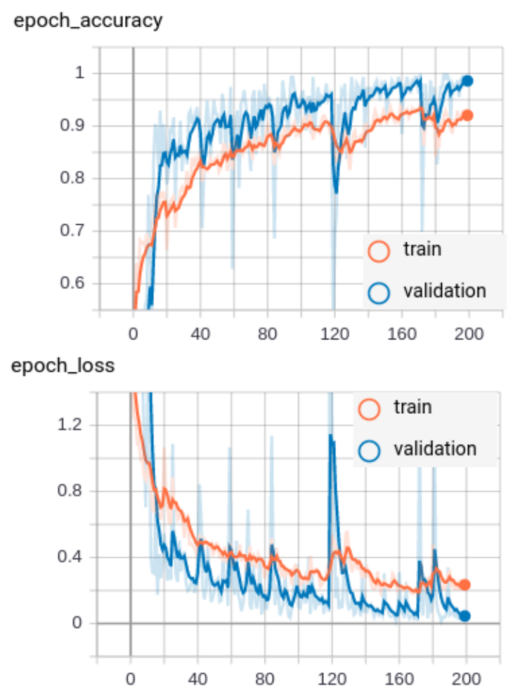

## Basic framework for deep learning neural network face recognition

#### - Video stream image recognition of family members
[](https://legarage.wordpress.com/)
Author: Aslak Einbu


### Overview

Deep learning neural network model built with Tensorflow. Image processing with OpenCV and Numpy.
Repository file structure:

```
.
├── network.py   	    # Deep learning convolutional neural network model
├── collect_faces.py        # Script for collecting face images for model training 
├── inspect_dataset.py      # Script for overview and inspection of image training sets 
├── train.py                # Script for training of neural net on images in 'treningssett'  
├── train_history.py        # Function for plotting of model training
├── predict_folder.py       # Script for testing predictions on images in a given directory
├── predict_video.py        # Script for real-time video stream processing and face recognition using trained models
│
├── model                   # Neural net models applied
│   ├── face_detect         # CNN for face detection
│   └── this                # Developed models from this framework
│ 
├── test_dataset            # Folder for images for testing model prediction
│ 
└── training_dataset        # Training images sorted in folders (subfolder name = label)        
    ├── person1
    ├── person2
    ├── person3
    ├── person4
    ├── person5
    └── person6
```

### Neural network
The applied network is a convolutional neural network setup by Adrian Rosebrock. The network is a
compact variant of the VGGNet network, introduced by Simonyan and Zisserman in their 2014 paper, 
[Very Deep Convolutional Networks for Large Scale Image Recognition](https://arxiv.org/abs/1409.1556).
The architectures uses 3×3 convolutional layers stacked on top of each other in increasing depth,
reducing volume size by max pooling and with fully-connected layers at the end of the network prior to 
a softmax classifier.

### Dataset preprocessing
The only image preprocessing applied, is rescaling to 96 x 96 pixel resolution, converting to grayscale 
and normalizing grayscale values:


### Model training
The current framework applies a separate neural net model for detection of faces in the pictures of a webcam video stream. 
These captured frames of faces are applied for collection of training images. The same algorithm is applied for determining 
faces for prediction during application of the trained model.

The figure below shows results from training of the above described convolutional neural net on a set of family member images.
The current model was trained on a total of 1118 images of 6 different family individuals (classes). 
Total size of training image dataset was only 4.9 MB :)

200 epochs of training with the network took 43 minutes on my Dell laptop.
The resulting model size was ~100 MB. The resulting model predicts individual faces well for real-time video stream processing.

An interesting feature is the ability the model gives for predicting percentage similarities between different family members :)





### Credits and inspiration
- Adrian Rosebrock's webpages on OpenCV and Deep Learning https://www.pyimagesearch.com


